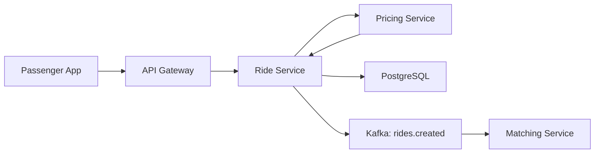

# 🚀 План разработки Pet Project Uber

## 📊 Текущее состояние проекта

### ✅ Что уже готово

1. **Инфраструктура**
   - Docker Compose конфигурация для всех сервисов
   - Kubernetes манифесты (deployments, services, HPA)
   - PostgreSQL с миграциями и seed данными
   - Redis конфигурация
   - Kafka + Zookeeper + Kafka UI
   - ClickHouse (добавлен в docker-compose)
   - Metabase для BI

2. **Документация**
   - Архитектура системы
   - Описание баз данных
   - API спецификация
   - Kafka топики и события
   - Makefile с командами управления

3. **Данные**
   - Миграции БД (users, drivers, rides, payments, tariffs, ab_experiments)
   - Скрипт генерации тестовых данных
   - 1M+ записей поездок в PostgreSQL

4. **Структура сервисов**
   - Созданы директории для всех 13 микросервисов
   - Dockerfiles для каждого сервиса
   - Базовая структура файлов (config, models, routers, tests)

### ❌ Что нужно реализовать

1. **Микросервисы** - файлы созданы, но пустые (main.py, main.go)
2. **Frontend приложения** - структура есть, но файлы пустые
3. **ClickHouse схема** - init.sql пустой
4. **Kafka топики** - нужно создать скрипт инициализации
5. **Мониторинг** - Prometheus + Grafana
6. **CI/CD** - GitHub Actions
7. **Тесты** - unit, integration, e2e, load

---

## 🎯 Стратегия разработки

### Принципы

1. **Итеративная разработка** - создаем минимальный рабочий прототип, затем расширяем
2. **Вертикальные срезы** - реализуем полный flow от frontend до БД
3. **Тестирование на каждом этапе** - проверяем работоспособность сразу
4. **Документирование по ходу** - обновляем docs при изменениях

### Приоритеты

**Высокий приоритет (MVP):**
- Базовые CRUD сервисы (User, Driver, Ride)
- API Gateway с аутентификацией
- Простой Matching Service
- Один frontend (Passenger App)

**Средний приоритет:**
- Geo Service для поиска водителей
- Pricing Service
- Payment Service (mock)
- Notification Service
- Analytics Service + ClickHouse

**Низкий приоритет (расширения):**
- ML Service
- AB Test Service
- Driver App и Admin Panel
- Мониторинг и алертинг

---

## 📋 Детальный план разработки

### Фаза 1: Базовая инфраструктура и Auth (3-5 дней)

#### 1.1 Инициализация инфраструктуры

**Задачи:**
- Создать init.sql для ClickHouse с таблицами аналитики
- Реализовать скрипт создания Kafka топиков
- Проверить работу всех контейнеров через docker-compose
- Настроить переменные окружения в .env

**Файлы:**
- `infrastructure/clickhouse/init.sql`
- `scripts/create_kafka_topics.sh`
- `.env`

**Проверка:**
```bash
make up
make ps
make kafka-list-topics
make shell-clickhouse
```

#### 1.2 Auth Service (Go)

**Задачи:**
- Реализовать регистрацию пользователя (POST /register)
- Реализовать логин (POST /login)
- Генерация и валидация JWT токенов
- Refresh token механизм
- Хранение сессий в Redis
- Unit тесты

**Файлы:**
- `services/auth-service/main.go`
- `services/auth-service/handlers/*.go`
- `services/auth-service/jwt/jwt.go`
- `services/auth-service/tests/auth_test.go`

**API endpoints:**
```
POST /api/v1/auth/register
POST /api/v1/auth/login
POST /api/v1/auth/refresh
POST /api/v1/auth/logout
```

**Проверка:**
```bash
curl -X POST http://localhost:8000/api/v1/auth/register \
  -H "Content-Type: application/json" \
  -d '{"email":"test@example.com","password":"password123","role":"passenger"}'
```

#### 1.3 API Gateway (Go)

**Задачи:**
- Настроить роутинг к сервисам
- Middleware для JWT аутентификации
- Rate limiting через Redis
- Логирование запросов
- CORS настройка
- Health check endpoints

**Файлы:**
- `services/api-gateway/main.go`
- `services/api-gateway/config/config.go`
- `services/api-gateway/handlers/proxy.go`
- `services/api-gateway/middleware/*.go`

**Маршруты:**
```
/api/v1/auth/*      -> auth-service:8000
/api/v1/users/*     -> user-service:8001
/api/v1/drivers/*   -> driver-service:8002
/api/v1/rides/*     -> ride-service:8003
/api/v1/pricing/*   -> pricing-service:8006
/api/v1/payments/*  -> payment-service:8007
```

**Проверка:**
```bash
make health
curl http://localhost:8080/health
```

---

### Фаза 2: Основные CRUD сервисы (5-7 дней)

#### 2.1 User Service (Python/FastAPI)

**Задачи:**
- CRUD операции для пользователей
- Получение профиля пользователя
- Обновление профиля
- История поездок пользователя
- Кэширование в Redis
- Unit и integration тесты

**Файлы:**
- `services/user-service/main.py`
- `services/user-service/models/user.py`
- `services/user-service/repositories/user_repository.py`
- `services/user-service/routers/users.py`
- `services/user-service/services/user_service.py`

**API endpoints:**
```
GET    /api/v1/users/me
GET    /api/v1/users/{user_id}
PUT    /api/v1/users/{user_id}
DELETE /api/v1/users/{user_id}
GET    /api/v1/users/{user_id}/rides
```

**Технологии:**
- FastAPI
- SQLAlchemy (async)
- Pydantic для валидации
- Redis для кэша

#### 2.2 Driver Service (Python/FastAPI)

**Задачи:**
- CRUD операции для водителей
- Управление статусом (online/offline/busy)
- Обновление локации водителя
- История поездок водителя
- Статистика заработка
- Публикация событий в Kafka (drivers.online, drivers.offline)

**Файлы:**
- `services/driver-service/main.py`
- `services/driver-service/models/driver.py`
- `services/driver-service/repositories/driver_repository.py`
- `services/driver-service/routers/drivers.py`
- `services/driver-service/services/driver_service.py`

**API endpoints:**
```
GET    /api/v1/drivers/me
GET    /api/v1/drivers/{driver_id}
PUT    /api/v1/drivers/{driver_id}
POST   /api/v1/drivers/{driver_id}/status
POST   /api/v1/drivers/{driver_id}/location
GET    /api/v1/drivers/{driver_id}/rides
GET    /api/v1/drivers/{driver_id}/earnings
```

**Kafka события:**
- `drivers.online` - водитель вышел на линию
- `drivers.offline` - водитель ушел с линии
- `drivers.location` - обновление координат

#### 2.3 Ride Service (Python/FastAPI)

**Задачи:**
- Создание новой поездки
- Управление статусами поездки (pending, assigned, started, completed, cancelled)
- Получение информации о поездке
- Отмена поездки
- Публикация событий в Kafka
- Интеграция с Pricing Service

**Файлы:**
- `services/ride-service/main.py`
- `services/ride-service/models/ride.py`
- `services/ride-service/routers/rides.py`
- `services/ride-service/services/ride_service.py`
- `services/ride-service/kafka/producer.py`

**API endpoints:**
```
POST   /api/v1/rides
GET    /api/v1/rides/{ride_id}
PUT    /api/v1/rides/{ride_id}/status
POST   /api/v1/rides/{ride_id}/cancel
GET    /api/v1/rides/{ride_id}/track
```

**Kafka события:**
- `rides.created` - новая поездка создана
- `rides.started` - поездка началась
- `rides.completed` - поездка завершена
- `rides.cancelled` - поездка отменена

**Workflow создания поездки:**


---

### Фаза 3: Geo и Matching (4-6 дней)

#### 3.1 Geo Service (Go)

**Задачи:**
- Обновление координат водителей в Redis Geo
- Поиск ближайших водителей (GEORADIUS)
- Подписка на Kafka топик drivers.location
- Оптимизация запросов к Redis
- Кэширование результатов поиска

**Файлы:**
- `services/geo-service/main.go`
- `services/geo-service/handlers/nearby.go`
- `services/geo-service/storage/redis_geo.go`
- `services/geo-service/tests/geo_test.go`

**API endpoints:**
```
GET /api/v1/geo/nearby?lat=40.7128&lon=-74.0060&radius=3000
POST /api/v1/geo/update
```

**Redis структуры:**
```
GEOADD drivers:geo -74.0060 40.7128 driver_123
GEORADIUS drivers:geo -74.0060 40.7128 3 km WITHDIST
```

#### 3.2 Matching Service (Go)

**Задачи:**
- Подписка на Kafka топик rides.created
- Поиск подходящих водителей через Geo Service
- Алгоритм выбора лучшего водителя (расстояние + рейтинг)
- Назначение водителя на поездку
- Публикация события rides.assigned
- Обработка отказов водителя

**Файлы:**
- `services/matching-service/main.go`
- `services/matching-service/consumer/kafka_consumer.go`
- `services/matching-service/matcher/matcher.go`
- `services/matching-service/geo/redis_geo.go`

**Алгоритм matching:**
```
1. Получить событие rides.created из Kafka
2. Запросить ближайших водителей у Geo Service (радиус 5 км)
3. Отфильтровать онлайн водителей (статус = online)
4. Рассчитать score для каждого: score = rating * 0.7 + (1 / distance) * 0.3
5. Выбрать водителя с максимальным score
6. Обновить ride.driver_id в PostgreSQL
7. Опубликовать rides.assigned в Kafka
```

**Kafka flow:**
```
rides.created -> Matching Service -> rides.assigned
```

---

### Фаза 4: Pricing и Payment (3-4 дня)

#### 4.1 Pricing Service (Python/FastAPI)

**Задачи:**
- Расчет стоимости поездки
- Базовый тариф + расстояние + время
- Surge pricing (повышающий коэффициент)
- Получение тарифов из PostgreSQL
- Кэширование тарифов в Redis

**Файлы:**
- `services/pricing-service/main.py`
- `services/pricing-service/routers/pricing.py`
- `services/pricing-service/services/calculator.py`
- `services/pricing-service/services/surge.py`

**API endpoints:**
```
POST /api/v1/pricing/calculate
GET  /api/v1/pricing/tariffs
GET  /api/v1/pricing/surge
```

**Формула расчета:**
```python
base_fare = 2.55
distance_fare = distance_km * tariff.per_km
time_fare = duration_minutes * tariff.per_minute
surge_multiplier = get_surge_multiplier(pickup_location, time)
total = (base_fare + distance_fare + time_fare) * surge_multiplier
```

#### 4.2 Payment Service (Python/FastAPI)

**Задачи:**
- Обработка платежей (mock интеграция)
- Подписка на Kafka топик rides.completed
- Создание записи о платеже в PostgreSQL
- Публикация события payments.completed
- Обработка ошибок платежей

**Файлы:**
- `services/payment-service/main.py`
- `services/payment-service/models/payment.py`
- `services/payment-service/routers/payments.py`
- `services/payment-service/services/payment_service.py`
- `services/payment-service/kafka/producer.py`

**API endpoints:**
```
POST /api/v1/payments
GET  /api/v1/payments/{payment_id}
GET  /api/v1/payments/ride/{ride_id}
```

**Kafka flow:**
```
rides.completed -> Payment Service -> payments.completed
```

---

### Фаза 5: Notifications и Analytics (3-4 дня)

#### 5.1 Notification Service (Python/FastAPI)

**Задачи:**
- Подписка на Kafka топики (rides.assigned, rides.completed, payments.completed)
- Mock отправка Push уведомлений
- Mock отправка SMS
- Mock отправка Email
- Логирование всех уведомлений

**Файлы:**
- `services/notification-service/main.py`
- `services/notification-service/consumer/kafka_consumer.py`
- `services/notification-service/senders/push.py`
- `services/notification-service/senders/sms.py`
- `services/notification-service/senders/email.py`

**Типы уведомлений:**
- Водитель найден (пассажиру)
- Новый заказ (водителю)
- Поездка началась (пассажиру)
- Поездка завершена (обоим)
- Платеж обработан (пассажиру)

#### 5.2 Analytics Service (Python/FastAPI)

**Задачи:**
- Подписка на все Kafka топики
- Запись событий в ClickHouse
- Агрегация метрик
- API для получения статистики

**Файлы:**
- `services/analytics-service/main.py`
- `services/analytics-service/consumer/kafka_consumer.py`
- `services/analytics-service/clickhouse/writer.py`

**ClickHouse таблицы:**
```sql
-- Таблица событий поездок
CREATE TABLE ride_events (
    event_id String,
    event_type String,
    ride_id String,
    user_id String,
    driver_id String,
    timestamp DateTime,
    data String
) ENGINE = MergeTree()
ORDER BY (timestamp, ride_id);

-- Таблица дневной статистики
CREATE TABLE daily_stats (
    date Date,
    total_rides UInt32,
    completed_rides UInt32,
    cancelled_rides UInt32,
    total_revenue Decimal(10,2),
    avg_ride_duration Float32,
    avg_ride_distance Float32
) ENGINE = SummingMergeTree()
ORDER BY date;
```

**API endpoints:**
```
GET /api/v1/analytics/rides/stats
GET /api/v1/analytics/drivers/stats
GET /api/v1/analytics/revenue
```

---

### Фаза 6: Frontend - Passenger App (5-7 дней)

#### 6.1 Базовая структура

**Задачи:**
- Настроить React + TypeScript
- Настроить React Router
- Настроить Axios для API запросов
- Настроить state management (Context API или Redux)
- Интеграция с картами (Leaflet или Google Maps)

**Файлы:**
- `frontend/passenger-app/package.json`
- `frontend/passenger-app/src/App.tsx`
- `frontend/passenger-app/src/api/client.ts`
- `frontend/passenger-app/src/context/AuthContext.tsx`

**Зависимости:**
```json
{
  "dependencies": {
    "react": "^18.2.0",
    "react-dom": "^18.2.0",
    "react-router-dom": "^6.20.0",
    "axios": "^1.6.0",
    "leaflet": "^1.9.4",
    "react-leaflet": "^4.2.1",
    "@tanstack/react-query": "^5.0.0"
  }
}
```

#### 6.2 Страницы и компоненты

**Страницы:**
1. **Login/Register** - аутентификация
2. **Home** - главная с картой и формой заказа
3. **RideTracking** - отслеживание текущей поездки
4. **RideHistory** - история поездок
5. **Profile** - профиль пользователя

**Компоненты:**
- `Map.tsx` - карта с маркерами
- `RideForm.tsx` - форма заказа поездки
- `DriverInfo.tsx` - информация о водителе
- `RideStatus.tsx` - статус поездки
- `PaymentMethod.tsx` - выбор способа оплаты

**Файлы:**
- `frontend/passenger-app/src/pages/*.tsx`
- `frontend/passenger-app/src/components/*.tsx`

#### 6.3 Интеграция с API

**API клиент:**
```typescript
// src/api/client.ts
import axios from 'axios';

const apiClient = axios.create({
  baseURL: process.env.REACT_APP_API_URL || 'http://localhost:8080',
  headers: {
    'Content-Type': 'application/json',
  },
});

// Interceptor для добавления JWT токена
apiClient.interceptors.request.use((config) => {
  const token = localStorage.getItem('token');
  if (token) {
    config.headers.Authorization = `Bearer ${token}`;
  }
  return config;
});

export default apiClient;
```

**Основные API вызовы:**
- `POST /api/v1/auth/login`
- `POST /api/v1/rides` - создать поездку
- `GET /api/v1/rides/{id}` - получить статус поездки
- `GET /api/v1/users/me/rides` - история поездок

---

### Фаза 7: ML Service (опционально, 4-6 дней)

#### 7.1 ETA Predictor

**Задачи:**
- Обучить модель прогноза времени прибытия
- Использовать исторические данные из PostgreSQL
- Features: расстояние, время суток, день недели, погода
- Сохранить модель в pickle/joblib
- API endpoint для прогноза

**Файлы:**
- `services/ml-service/training/train_eta.py`
- `services/ml-service/models/eta_predictor.py`
- `services/ml-service/routers/predictions.py`

**Модель:**
```python
from sklearn.ensemble import RandomForestRegressor
import pandas as pd

# Features
X = df[['distance_km', 'hour', 'day_of_week', 'is_rush_hour']]
y = df['duration_minutes']

model = RandomForestRegressor(n_estimators=100)
model.fit(X, y)
```

#### 7.2 Demand Predictor

**Задачи:**
- Прогноз спроса по районам
- Временные ряды (Prophet или ARIMA)
- Рекомендации для водителей (куда ехать)

#### 7.3 Fraud Detector

**Задачи:**
- Обнаружение подозрительных поездок
- Аномалии в паттернах поведения
- Isolation Forest или Autoencoder

---

### Фаза 8: AB Test Service (опционально, 2-3 дня)

**Задачи:**
- Создание экспериментов
- Bucketing пользователей (consistent hashing)
- Сбор метрик по группам
- Статистический анализ результатов

**Файлы:**
- `services/ab-test-service/main.py`
- `services/ab-test-service/models/experiment.py`
- `services/ab-test-service/services/bucketing.py`
- `services/ab-test-service/services/analysis.py`

**API endpoints:**
```
POST /api/v1/experiments
GET  /api/v1/experiments/{id}
POST /api/v1/experiments/{id}/assign
GET  /api/v1/experiments/{id}/results
```

**Примеры экспериментов:**
- Новый алгоритм matching
- Изменение UI
- Новая формула pricing

---

### Фаза 9: Driver App и Admin Panel (5-7 дней)

#### 9.1 Driver App

**Страницы:**
- Login
- Dashboard (статус, заработок)
- Incoming Rides (входящие заказы)
- Active Ride (текущая поездка)
- Earnings (статистика заработка)

#### 9.2 Admin Panel

**Страницы:**
- Dashboard (общая статистика)
- Users (управление пользователями)
- Drivers (управление водителями)
- Rides (просмотр поездок)
- AB Tests (управление экспериментами)

---

### Фаза 10: Мониторинг и Observability (3-4 дня)

#### 10.1 Prometheus + Grafana

**Задачи:**
- Добавить Prometheus в docker-compose
- Настроить scraping метрик из сервисов
- Создать Grafana дашборды
- Метрики: RPS, latency, error rate, CPU, memory

**Файлы:**
- `infrastructure/prometheus/prometheus.yml`
- `infrastructure/grafana/dashboards/*.json`

**Метрики для сбора:**
- HTTP requests (по endpoint)
- Kafka lag
- Database connections
- Redis hit/miss rate
- Ride creation rate
- Matching success rate

#### 10.2 Logging (ELK Stack - опционально)

**Задачи:**
- Elasticsearch для хранения логов
- Logstash для агрегации
- Kibana для визуализации

---

### Фаза 11: Тестирование (4-6 дней)

#### 11.1 Unit тесты

**Задачи:**
- Покрытие всех сервисов unit тестами
- Цель: 70%+ coverage
- Использовать pytest для Python, testing для Go

**Примеры:**
```python
# services/user-service/tests/test_users.py
def test_create_user():
    user_data = {"email": "test@example.com", "name": "Test"}
    response = client.post("/api/v1/users", json=user_data)
    assert response.status_code == 201
```

#### 11.2 Integration тесты

**Задачи:**
- Тестирование взаимодействия сервисов
- Использовать testcontainers для PostgreSQL, Redis, Kafka
- Проверка полных flow (создание поездки -> matching -> payment)

#### 11.3 E2E тесты

**Задачи:**
- Playwright или Selenium для frontend
- Тестирование пользовательских сценариев
- Автоматизация критичных путей

#### 11.4 Load тесты

**Задачи:**
- Locust для нагрузочного тестирования
- Сценарии: создание поездок, поиск водителей
- Цель: 1000 RPS на создание поездок

**Файл:**
```python
# tests/load/locustfile.py
from locust import HttpUser, task, between

class PassengerUser(HttpUser):
    wait_time = between(1, 3)
    
    @task
    def create_ride(self):
        self.client.post("/api/v1/rides", json={
            "pickup": {"lat": 40.7128, "lon": -74.0060},
            "dropoff": {"lat": 40.7580, "lon": -73.9855}
        })
```

---

### Фаза 12: CI/CD (2-3 дня)

#### 12.1 GitHub Actions

**Задачи:**
- Workflow для тестирования (на каждый PR)
- Workflow для сборки Docker образов
- Workflow для деплоя в Kubernetes
- Автоматический запуск тестов

**Файл:**
```yaml
# .github/workflows/ci.yml
name: CI

on:
  push:
    branches: [main, develop]
  pull_request:
    branches: [main, develop]

jobs:
  test:
    runs-on: ubuntu-latest
    steps:
      - uses: actions/checkout@v3
      - name: Run tests
        run: |
          docker-compose up -d postgres redis kafka
          make test
          
  build:
    needs: test
    runs-on: ubuntu-latest
    steps:
      - uses: actions/checkout@v3
      - name: Build images
        run: make build
      - name: Push to registry
        run: make push
```

#### 12.2 Deployment

**Задачи:**
- Автоматический деплой в Kubernetes при merge в main
- Rollback механизм
- Blue-green deployment

---

## 🎯 Рекомендуемый порядок реализации

### Итерация 1: MVP (2-3 недели)

**Цель:** Минимальный рабочий прототип с базовым функционалом

1. ✅ Инфраструктура (ClickHouse init, Kafka topics)
2. ✅ Auth Service (регистрация, логин, JWT)
3. ✅ API Gateway (роутинг, auth middleware)
4. ✅ User Service (CRUD)
5. ✅ Driver Service (CRUD, статус)
6. ✅ Ride Service (создание, статусы)
7. ✅ Pricing Service (базовый расчет)
8. ✅ Простой Matching (без Geo, просто первый доступный водитель)
9. ✅ Passenger App (login, создание поездки, просмотр статуса)

**Результат:** Можно заказать поездку, назначить водителя, увидеть статус

### Итерация 2: Улучшение Matching (1-2 недели)

10. ✅ Geo Service (Redis Geo, поиск ближайших)
11. ✅ Улучшенный Matching Service (учет расстояния и рейтинга)
12. ✅ Обновление локации водителя в реальном времени

**Результат:** Умный подбор водителей по расстоянию

### Итерация 3: Платежи и уведомления (1 неделя)

13. ✅ Payment Service (mock платежи)
14. ✅ Notification Service (push, sms, email)
15. ✅ Интеграция с Kafka

**Результат:** Полный цикл поездки с оплатой и уведомлениями

### Итерация 4: Аналитика (1 неделя)

16. ✅ Analytics Service
17. ✅ ClickHouse схема и запись событий
18. ✅ Metabase дашборды

**Результат:** Можно анализировать данные и строить отчеты

### Итерация 5: Дополнительные фичи (2-3 недели)

19. ✅ ML Service (ETA, demand prediction)
20. ✅ AB Test Service
21. ✅ Driver App
22. ✅ Admin Panel

**Результат:** Полнофункциональная система

### Итерация 6: Production Ready (1-2 недели)

23. ✅ Мониторинг (Prometheus + Grafana)
24. ✅ Все типы тестов (unit, integration, e2e, load)
25. ✅ CI/CD (GitHub Actions)
26. ✅ Документация

**Результат:** Production-ready система

---

## 📊 Метрики успеха

### Технические метрики

- **Покрытие тестами:** >70%
- **API latency:** <200ms (p95)
- **Throughput:** >1000 RPS на создание поездок
- **Uptime:** >99.9%
- **Kafka lag:** <1 секунда

### Функциональные метрики

- ✅ Пользователь может зарегистрироваться
- ✅ Пользователь может заказать поездку
- ✅ Система находит ближайшего водителя за <5 секунд
- ✅ Водитель получает уведомление о новом заказе
- ✅ Пассажир видит информацию о водителе
- ✅ Платеж обрабатывается автоматически
- ✅ Все события записываются в аналитику

---

## 🛠 Технологический стек (итоговый)

### Backend
- **Go:** API Gateway, Auth Service, Matching Service, Geo Service
- **Python:** User, Driver, Ride, Pricing, Payment, Notification, ML, AB Test, Analytics Services
- **FastAPI:** Web framework для Python сервисов
- **Gin/Echo:** Web framework для Go сервисов

### Databases
- **PostgreSQL:** Основная БД (users, drivers, rides, payments)
- **Redis:** Кэш, сессии, geo-индекс, rate limiting
- **ClickHouse:** Аналитическая БД

### Message Broker
- **Apache Kafka:** Асинхронная коммуникация

### Frontend
- **React + TypeScript:** Все 3 приложения
- **React Router:** Навигация
- **Axios:** HTTP клиент
- **React Query:** State management для API
- **Leaflet:** Карты

### Infrastructure
- **Docker + Docker Compose:** Локальная разработка
- **Kubernetes:** Production deployment
- **Prometheus + Grafana:** Мониторинг
- **Metabase:** BI и дашборды

### CI/CD
- **GitHub Actions:** Автоматизация
- **Docker Registry:** Хранение образов

### Testing
- **pytest:** Python unit/integration тесты
- **Go testing:** Go unit тесты
- **Playwright:** E2E тесты
- **Locust:** Load тесты

---

## 📝 Следующие шаги

### Немедленные действия

1. **Создать ClickHouse init.sql** с таблицами для аналитики
2. **Реализовать Auth Service** - это фундамент для всех остальных сервисов
3. **Настроить API Gateway** - единая точка входа
4. **Запустить все через docker-compose** и проверить работоспособность

### Вопросы для уточнения

1. **Приоритет фронтенда:** Начать с Passenger App сразу или после реализации всех backend сервисов?
2. **ML сервис:** Реализовывать сейчас или отложить на потом?
3. **Тестирование:** Писать тесты параллельно с разработкой или в конце?
4. **Deployment:** Планируется ли реальный деплой в облако (AWS/GCP/Azure)?

---

## 🎓 Что это даст для резюме

### Демонстрируемые навыки

1. **Микросервисная архитектура** - 13 независимых сервисов
2. **Event-driven architecture** - Kafka для асинхронной коммуникации
3. **Polyglot programming** - Go + Python
4. **Databases** - PostgreSQL, Redis, ClickHouse
5. **Containerization** - Docker, Docker Compose
6. **Orchestration** - Kubernetes, HPA, deployments
7. **API Design** - RESTful API, OpenAPI
8. **Frontend** - React, TypeScript
9. **Testing** - Unit, Integration, E2E, Load
10. **CI/CD** - GitHub Actions
11. **Monitoring** - Prometheus, Grafana
12. **ML** - Прогнозирование, аномалии
13. **A/B Testing** - Эксперименты и анализ

### Возможные вопросы на собеседовании

- Как вы обеспечиваете консистентность данных между сервисами?
- Что происходит если Kafka упадет?
- Как вы масштабируете Matching Service?
- Как обрабатываете race conditions при назначении водителя?
- Как тестируете асинхронные процессы?
- Как мониторите здоровье системы?

---

## 📚 Полезные ресурсы

### Документация
- [FastAPI](https://fastapi.tiangolo.com/)
- [Kafka](https://kafka.apache.org/documentation/)
- [Redis Geo](https://redis.io/commands/geoadd/)
- [ClickHouse](https://clickhouse.com/docs/)
- [Kubernetes](https://kubernetes.io/docs/)

### Примеры
- [Uber Engineering Blog](https://eng.uber.com/)
- [Microservices Patterns](https://microservices.io/patterns/)

---

**Готов начать разработку! С чего хотите начать?**
